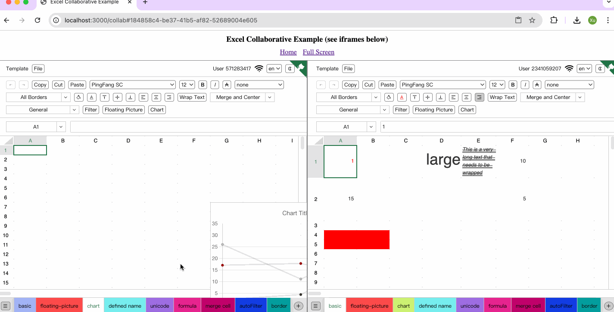

# Online Collaboration Excel

[](https://github.com/nusr/excel/actions/workflows/main.yml)
[](https://codecov.io/gh/nusr/excel)


English | [中文](./README_zh.md)

[Online Demo](https://nusr.github.io/excel)



## Installation

```bash
npm i --save excel-collab
```

## Quick Start

1. Create a React app

```bash
npm create vite@latest my-app -- --template react-ts
cd my-app
npm i
```

2. Install the Required Libraries

```bash
npm i --save excel-collab
```

3. Modify the Main File

```ts src/main.tsx
// src/main.tsx
import { createRoot } from 'react-dom/client';
import { StrictMode } from 'react';
import { Excel } from 'excel-collab';
import 'excel-collab/style.css';

createRoot(document.getElementById('root')!).render(
  <StrictMode>
    <Excel style={{ height: '100vh' }} />
  </StrictMode>,
);
```

4. Start the app

```bash
npm run dev
```

## Examples

- [Simple Example](https://stackblitz.com/edit/nusr-excel-simple)
- [Custom Example](https://stackblitz.com/edit/nusr-excel-custom)

## Collaboration Example

```bash
git clone https://github.com/nusr/excel.git
cd excel

npm i -g yarn
yarn
npm run start
```

## Supported Features

- [x] Online Collaboration
- [x] Create File
- [x] Change File Name
- [x] Web Worker parse formulas
- [x] OffScreenCanvas Render
- [x] Undo
- [x] Redo
- [x] Copy
- [x] Cut
- [x] Paste
- [x] Formulas
- [x] Font Family
- [x] Font Size
- [x] Font Color
- [x] Fill Color
- [x] Bold
- [x] Italic
- [x] Strike
- [x] Underline
- [x] Border
- [x] Text Vertical Align
- [x] Text Horizontal Align
- [x] Text Wrapping
- [x] Number Format
- [x] AutoFilter
- [x] Merge Cells
- [x] Chart
- [x] Floating Picture
- [x] Define Name
- [x] Insert Row
- [x] Insert Column
- [x] Delete Row
- [x] Delete Column
- [x] Hide Row
- [x] Hide Column
- [x] Row Height
- [x] Column Width
- [x] Insert Sheet
- [x] Delete Sheet
- [x] Rename Sheet
- [x] Hide Sheet
- [x] Unhide Sheet
- [x] Import XLSX
- [x] Export XLSX
- [x] Import CSV
- [x] Export CSV
- [x] Dark Mode
- [x] I18N

## Supported Formulas

formulas supported by [formulajs](https://github.com/formulajs/formulajs)
