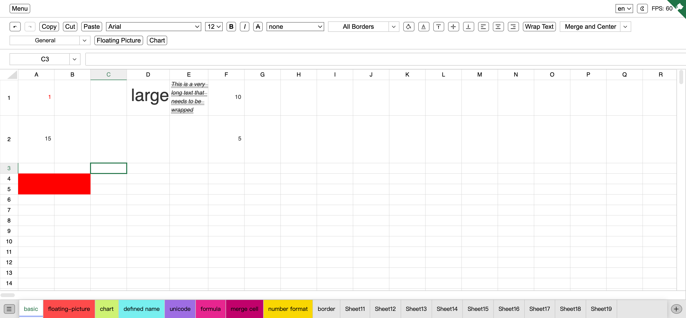

# Online Excel

[](https://github.com/nusr/excel/actions/workflows/main.yml)
[](https://codecov.io/gh/nusr/excel)


[online demo](https://nusr.github.io/excel/)



## Start

```bash
git clone https://github.com/nusr/excel.git
cd excel

npm i -g pnpm
pnpm i
npm run start
```

## Directory Description

```bash
src
├── canvas         # two layer canvas
├── components     # basic components
├── containers     # spreadsheet view
│   ├── Excel      # Excel export and import
│   ├── hooks      # common React hooks
│   └── store      # global state management
├── controller     # spreadsheet controller
├── formula        # Recursive descent parser parse Excel formulas
├── i18n           # i18n
├── model          # spreadsheet model
├── theme          # dark mode
├── types          # TypeScript types
└── util           # common methods
```

## All Dependencies

- [esbulid](https://github.com/evanw/esbuild)
- [react](https://github.com/facebook/react)
- [jszip](https://github.com/Stuk/jszip)
- [chart.js](https://github.com/chartjs/Chart.js)
- [ssf](https://git.sheetjs.com/sheetjs/sheetjs/src/branch/master/packages/ssf)

## Supported Features

- [x] Worker parse formulas
- [x] OffScreenCanvas
- [x] Undo
- [x] Redo
- [x] Copy
- [x] Cut
- [x] Paste
- [x] Formulas
- [x] Font Family
- [x] Font Size
- [x] Font Color
- [x] Fill Color
- [x] Bold
- [x] Italic
- [x] Strike
- [x] Underline
- [x] Border
- [x] Text Vertical Align
- [x] Text Horizontal Align
- [x] Text Wrapping
- [x] Number Format
- [x] Merge Cells
- [x] Chart
- [x] Floating Picture
- [x] Define Name
- [x] Insert Row
- [x] Insert Column
- [x] Delete Row
- [x] Delete Column
- [x] Hide Row
- [x] Hide Column
- [x] Row Height
- [x] Column Width
- [x] Insert Sheet
- [x] Delete Sheet
- [x] Rename Sheet
- [x] Hide Sheet
- [x] Unhide Sheet
- [x] Import XLSX
- [x] Export XLSX
- [x] Import CSV
- [x] Export CSV
- [x] Dark Mode
- [x] I18N

## Supported Formulas

### Math

- [x] ABS
- [x] ACOS
- [x] ACOSH
- [x] ACOT
- [x] ACOTH
- [x] ASIN
- [x] ASINH
- [x] ATAN
- [x] ATAN2
- [x] ATANH
- [x] AVERAGE
- [x] COS
- [x] COT
- [x] E
- [x] EXP
- [x] INT
- [x] PI
- [x] SIN
- [x] SUM

### Text

- [x] CHAR
- [x] CODE
- [x] CONCAT
- [x] CONCATENATE
- [x] LEN
- [x] LOWER
- [x] SPLIT
- [x] T
- [x] TRIM
- [x] UNICHAR
- [x] UNICODE
- [x] UPPER
